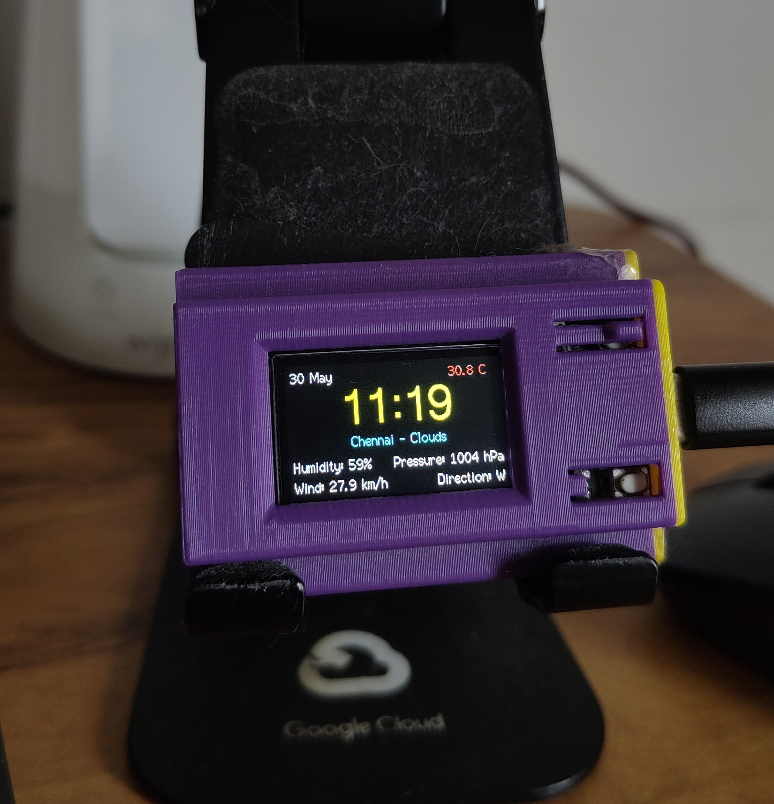

# ⏰📡 TTGO T-Display ESP32 – Clock + Weather Dashboard

This project turns your TTGO T-Display ESP32 into a real-time dashboard showing the current time, date, and weather info from OpenWeatherMap on a stylish 135x240 TFT screen.



---

## 🚀 Features

- **Live Weather Display** (via OpenWeatherMap API):
  - 🌡️ Temperature (color-coded)
  - 💧 Humidity
  - 🌬️ Wind speed + direction
  - 📈 Pressure
- **NTP Clock** synced to Indian Standard Time (IST) [Can be changed]
- **Minimal UI** optimized for 1.14" TFT
- **Auto-refresh** every 5 mins (weather) and 10 secs (clock)
- **Color-coded temperature for clarity**

---

## 🛠️ Requirements

### Hardware
- TTGO T-Display ESP32
- USB-C cable
- Wi-Fi access

### Libraries
Install these libraries via the Arduino Library Manager:
- `WiFi.h`
- `HTTPClient.h`
- `ArduinoJson`
- `TFT_eSPI`
- `SPI.h`
- `time.h`

---

## 📦 Setup Instructions

1. Clone or download this repo.
2. Open the `.ino` file in Arduino IDE.
3. Replace these lines in the code with your credentials:

```cpp
const char* ssid = "YourWiFiName";
const char* password = "YourWiFiPassword";
const char* apiKey = "YourOpenWeatherMapAPIKey";
const char* city = "YourCity";
const char* country = "YourCountryCode"; // e.g., "IN"
```

4. Connect your TTGO T-Display ESP32.
5. Select the correct port and board (ESP32 Dev Module).
6. Upload the code and watch the display light up!

---

## 🖥️ Screen Layout

```
┌────────────────────────────┐
│ DATE               TEMP    │
│                            │
│          HH:MM             │
│   City - WeatherType       │
│                            │
│ Humidity   Pressure        │
│ Wind       Direction       │
└────────────────────────────┘
```

---

## ⏱️ Refresh Rates

- **Weather Data**: Every 5 minutes (300,000 ms)
- **Clock/Screen Update**: Every 10 seconds (10,000 ms)

---

## 🎵 Upcoming: Spotify "Now Playing" Screen

Planning to add support for switching between the **Clock+Weather view** and a new **Spotify Now Playing view** using the working onboard button (1 button is broken, not sure which).

### Spotify View Will Include:
- 🎶 Current or last played track
- 🧑‍🎤 Artist name
- 💿 Album name
- ⏳ Scroll long song titles

**Using:**
- Spotify Web API
- Arduino HTTPClient
- OAuth2 refresh token method

Button press will toggle between:
- 🕒 Clock + Weather View
- 🎧 Spotify Track Info View

---

## ✅ To-Do List

- [x] Weather + Clock Display
- [ ] Button toggle between views
- [ ] Spotify integration (OAuth2 + Now Playing)
- [ ] Smooth UI transitions
- [ ] Handle token refresh and playback states

---

## 👤 Author

**Nikhil Nair**  
🌐 [nikhilnair.works](https://nikhilnair.works)  
🔗 [LinkedIn](https://linkedin.com/in/nikhilnair29)  
💻 [GitHub](https://github.com/icebelly29)

---

Made with ❤️ and a TTGO ESP32 that only has one working button.